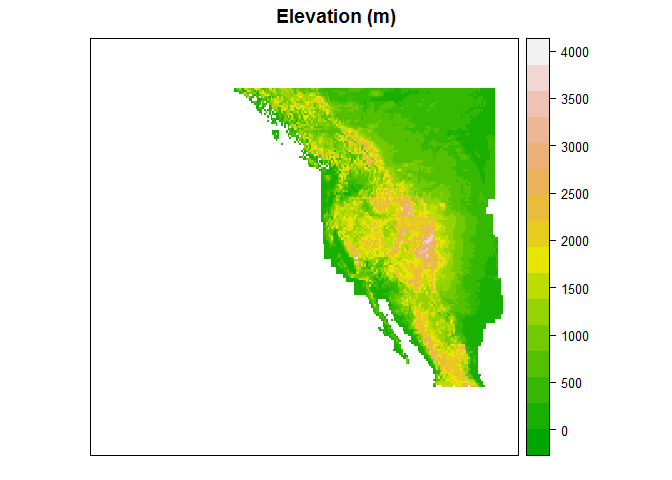
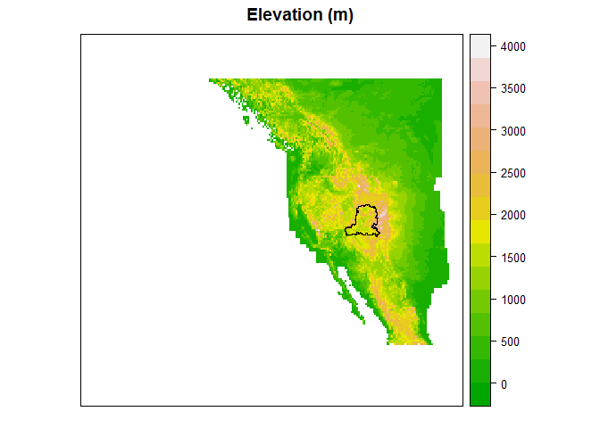
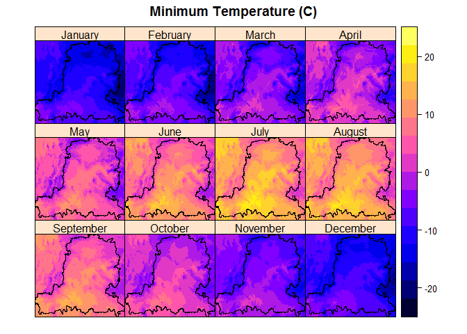
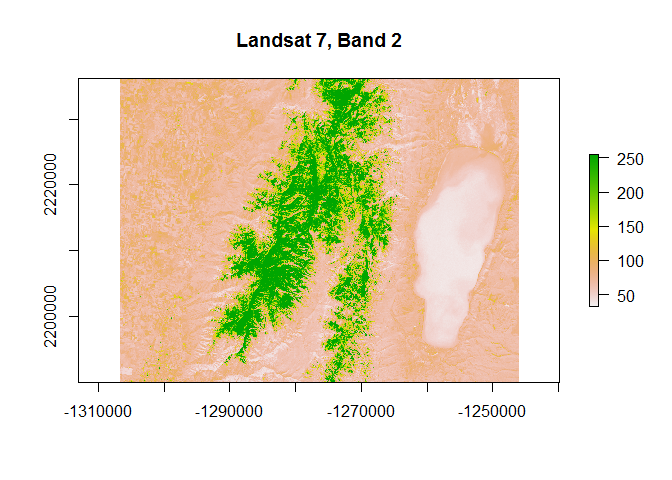
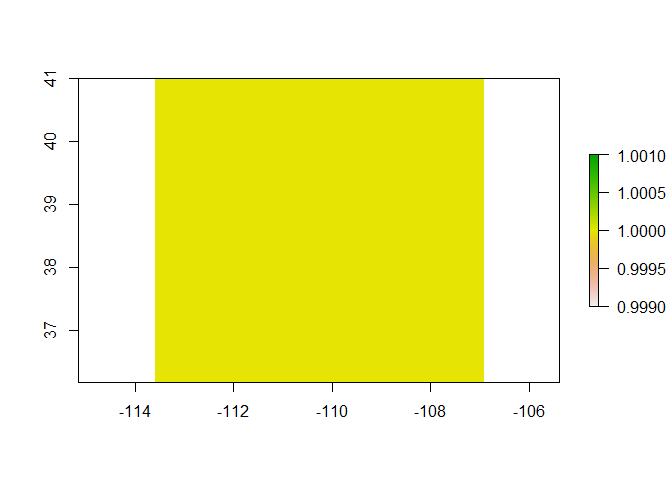
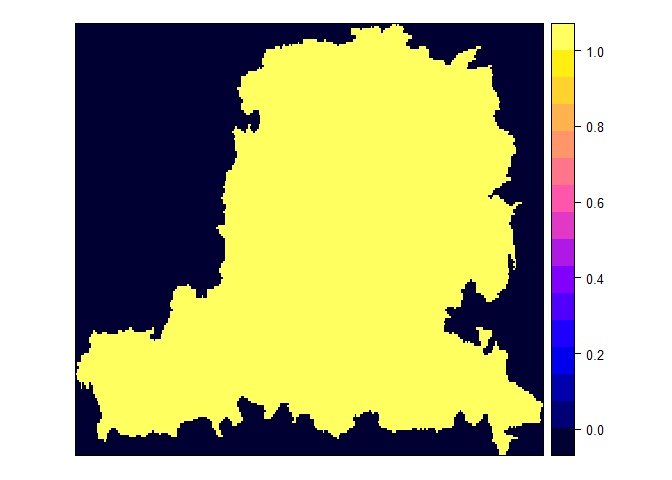

# Module 1.2: Importing and Exporting Raster GIS Data in R
IALE 2015 R GIS Workshop  
July 7, 2015  

Module 1.2 code by Jillian Deines, Michigan State University   


## R Packages Needed
The primary package for raster work is conveniently named `raster`.


```r
library(rgdal)        # R bindings for the Geospatial Data Abstraction Library
library(raster)       # workhorse raster package
library(latticeExtra) # for add-on functionality to the spplot function
```

## Set Your Working Directory
Here, we'll use the `setwd` function to tell R where the module 1 folder is located on our machine. This will depend on the location of your downloaded course folder, Intro-Spatial-R.


```r
# modify the filepath based on your user specific folder location
# Single or double quotes work for text strings. Must use forward slashes.

#Some common examples:
#setwd('C:/Users/username/Documents/Intro-Spatial-R/module1')   # for Windows users
#setwd("~/Documents/Intro-Spatial-R/module1")                   # ~ for Mac users
setwd('D:/RWorkshop/Intro-Spatial-R/module1')                   # Jill's computer  
```

## Load a Raster
The `raster` function in the raster package is quite flexible and can be used to read and write the following filetypes (type '?writeFormats' at the command line for more information via the help file):

* raster (.grd)
* ascii (.asc)
* SAGA (.sdat)
* IDRISI (.rst)
* netCDF (.nc, requires ncdf package)
* GeoTiff (.tif)
* ENVI (.envi)
* EHdr (.bil)
* HFA (.img)

The raster call works largely the same for all of these filetypes; here we will load a 1 km elevation file in HFA/ERDAS Imagine format (.img), "elev_1k_wgs.img", from the 'Intro-R-Spatial/module1/data' folder.

Note that for large rasters, the raster package loads information about the data structure (rows, columns, spatial extent, filename) but processes the data in chunks from the harddrive when needed for operations. This allows it to work with objects too large to be loaded into memory but can sometimes be slow.


```r
# load raster by specifying filename with extension; extension sets format
elev1km.wgs84 <- raster("data/elev_1k_wgs.img")
# type the name of the object to get information
elev1km.wgs84
```

```
## class       : RasterLayer 
## dimensions  : 6692, 8778, 58742376  (nrow, ncol, ncell)
## resolution  : 0.008333333, 0.008333333  (x, y)
## extent      : -164.0992, -90.9492, 10.69607, 66.46274  (xmin, xmax, ymin, ymax)
## coord. ref. : +proj=longlat +datum=WGS84 +no_defs +ellps=WGS84 +towgs84=0,0,0 
## data source : D:\RWorkshop\Intro-Spatial-R\module1\data\elev_1k_wgs.img 
## names       : elev_1k_wgs 
## values      : -121, 4362  (min, max)
```

NOT RUN: equivalent alternative example if not setting a working directory, based on Jill's computer's directory structure. This is essentially what `setwd` does under the hood - appends the working directory filepath to your directory call:


```r
elev1km.wgs84 <- raster("D:/RWorkshop/Intro-Spatial-R/module1/data/elev_1k_wgs.img")
```

Load our polygon boundary and plot, showing base `plot` and `spplot` examples.


```r
# load our polygon boundary in WGS84 (see module 1.1 for loading vector files)
cp.latlong <- readOGR(dsn = 'data', layer = 'COP_boundpoly_wgs84')
```

```
## OGR data source with driver: ESRI Shapefile 
## Source: "data", layer: "COP_boundpoly_wgs84"
## with 1 features
## It has 1 fields
```

```r
# plot the raster dataset using baseplot (plot) 
plot(elev1km.wgs84, 
     col = terrain.colors(16),     # terrain.colors is a base color ramp
     main = "Elevation (m)")       # title of plot
# add our polygon boundary
plot(cp.latlong, add=T)              
```

 

```r
# plot the raster dataset using spplot
spplot(elev1km.wgs84, col.regions=terrain.colors(16), main = "Elevation (m)")
```

 

```r
# add layers using spplot and `layer` function from latticeExtra package
spplot(elev1km.wgs84, col.regions=terrain.colors(16), main = "Elevation (m)") +  
  layer(sp.polygons(cp.latlong, col = 'black', lwd=1)) # example plotting options
```

 

Note that the extent is much larger than our study region; Module 2 will cover cropping and additional extent issues.

## Load Multiple Rasters (Stack)
The raster package can also load rasters of identical projection and extent directly into a raster stack, which can make operations on multiple rasters very efficient to execute. Module 2 will address modifying raster projection and extent for files that do not already match.

To load monthly minimum temperature (tmin) files from WorldClim, we will:

* get a list of raster files within the 'WorldClimClip' subfolder using the `list.files` function, using regex search patterns to return files of specific extension (or name, etc.)
* load files directly into a stack using `stack`
* make a basic panel plot using `spplot`


```r
rasterFiles <- list.files(path = 'data/worldClimClip',  # specify directory
                          pattern = "*tif$",         # restrict file names using regex
                          full.names=T)              # return full file path

# load all 12 rasters at once into a stack
tmin.stack <- stack(rasterFiles)
# get information; note the "nlayers" attribute
tmin.stack
```

```
## class       : RasterStack 
## dimensions  : 578, 801, 462978, 12  (nrow, ncol, ncell, nlayers)
## resolution  : 0.008333333, 0.008333333  (x, y)
## extent      : -113.6, -106.925, 36.18333, 41  (xmin, xmax, ymin, ymax)
## coord. ref. : +proj=longlat +datum=WGS84 +no_defs +ellps=WGS84 +towgs84=0,0,0 
## names       : tmin01_12, tmin02_12, tmin03_12, tmin04_12, tmin05_12, tmin06_12, tmin07_12, tmin08_12, tmin09_12, tmin10_12, tmin11_12, tmin12_12 
## min values  :      -221,      -207,      -191,      -140,       -84,       -44,       -12,       -18,       -44,       -80,      -144,      -196 
## max values  :        -3,        21,        48,        83,       134,       182,       225,       217,       169,       101,        37,        -3
```

```r
# define the projection for all 12 rasters
proj4string(tmin.stack) <- CRS("+proj=longlat +datum=WGS84")

# look at files. spplot uses R's lattice package to do automatic panelling
# May take ~1.5 minutes to make full panel of 12 plots
spplot(tmin.stack, 
       main = "Minimum Temperature",    # plot title
       names.attr = month.name) +       # manually set panel titles
  layer(sp.polygons(cp.latlong))        # add boundary polygon
```

 

Stacks are a great way to do batch operations; for example, note that the scale on the Tmin plot is inflated by one order of magnitude. The WorldClim files are stored without decimal values to reduce files size, so to get the actual minimum temperature, we need to divide all 12 rasters by a factor of 10.


```r
# divide all 12 tmin rasters by 10
tmin.stack.corrected <- tmin.stack / 10
# view change, note scale
spplot(tmin.stack.corrected, main = "Minimum Temperature (C)", 
       names.attr = month.name) + 
  layer(sp.polygons(cp.latlong))  
```

 

## Load specific layers of multi-band files
Many rasters such as Landsat files have multiple bands; to load a specific band, use the "band" argument of the `raster` function.

Here, we load band 2 from a Landsat 7 file, which represents the green band. 

Note: If you work with remote sensing, there are a few existing packages developed to work with RS data. For example, see the `landsat` package. There's also a `MODIS` package in advanced stages of development (not yet on CRAN but available from R-Forge) for programmatically downloading and processing MODIS tiles; if interested, Jill's written some ancillary code to make working with MODIS pretty easy and automated, available here: https://github.com/jdeines/Get-MODIS-R. 


```r
landsat7.2 <- raster("data/etm-038031-042600-123457_CROP.img", band = 2)
landsat7.2 # get info
```

```
## class       : RasterLayer 
## band        : 2  (of  6  bands)
## dimensions  : 1538, 2024, 3112912  (nrow, ncol, ncell)
## resolution  : 30, 30  (x, y)
## extent      : -1306785, -1246065, 2190015, 2236155  (xmin, xmax, ymin, ymax)
## coord. ref. : +proj=aea +lat_1=29.5 +lat_2=45.5 +lat_0=23 +lon_0=-96 +x_0=0 +y_0=0 +ellps=GRS80 +units=m +no_defs 
## data source : D:\RWorkshop\Intro-Spatial-R\module1\data\etm-038031-042600-123457_CROP.img 
## names       : etm.038031.042600.123457_CROP 
## values      : 27, 255  (min, max)
```

```r
plot(landsat7.2, main = "Landsat 7, Band 2") # plot
```

 


## Create Custom Raster Grid
It's often useful to create a raster grid with specified extent or resolution for various modeling and data processing purposes, such as creating a binary model grid for active cells or creating a raster template to rasterize data in other formats (matrices, polygons...). The `raster` function also allows several flexible ways to do this.

We'll use the Colorado Plateau boundary polygon to define the extent of a new raster.


```r
# get the extent of the Colorado Plateau using the bounding box 'bbox' function
cp.extent <- bbox(cp.latlong)
cp.extent
```

```
##          min        max
## x -113.60295 -106.92713
## y   36.18673   41.00238
```

```r
# option 1: create a raster with a specifed number of rows and columns
cp.ras1 <- raster(nrow=100, ncol=100, extent(cp.extent), 
                  crs=proj4string(cp.latlong),   # use projection from cp.latlong
                  vals = 1)                      # set all raster cell values to 1

cp.ras1 # note the resolution is different in X and Y; will depend on nrow/ncol 
```

```
## class       : RasterLayer 
## dimensions  : 100, 100, 10000  (nrow, ncol, ncell)
## resolution  : 0.06675826, 0.04815643  (x, y)
## extent      : -113.603, -106.9271, 36.18673, 41.00238  (xmin, xmax, ymin, ymax)
## coord. ref. : +proj=longlat +datum=WGS84 +no_defs +ellps=WGS84 +towgs84=0,0,0 
## data source : in memory
## names       : layer 
## values      : 1, 1  (min, max)
```

```r
# option 2: create a raster with a specified resolution
cp.ras2 <- raster(resolution = 0.008333333, extent(cp.extent), 
                  crs=proj4string(cp.latlong), vals = 1)
cp.ras2
```

```
## class       : RasterLayer 
## dimensions  : 578, 801, 462978  (nrow, ncol, ncell)
## resolution  : 0.008333333, 0.008333333  (x, y)
## extent      : -113.603, -106.928, 36.18571, 41.00238  (xmin, xmax, ymin, ymax)
## coord. ref. : +proj=longlat +datum=WGS84 +no_defs +ellps=WGS84 +towgs84=0,0,0 
## data source : in memory
## names       : layer 
## values      : 1, 1  (min, max)
```

```r
# example: create binary grid using a polygon 'mask'
plot(cp.ras2)
```

 

```r
cp.ras3 <- mask(cp.ras2,               # raster to be masked
                mask = cp.latlong,     # polygon defining the mask
                updatevalue = 0)       # set values outside poly to 0
spplot(cp.ras3)
```

 

## Write Out Raster
You can write out rasters in multiple formats (.tif, .img, etc) and multiple data types (binary, signed/unsigned integer, floating decimals) to manage file sizes, etc.

If the format arguments are omitted, `writeRaster` will infer the format from the filename extension, and will default to 'FLT4S' datatype. See ?dataType for options.

Here, we'll write out our binary grid, `cp.ras3`.


```r
writeRaster(cp.ras3, filename = 'data/outData/cpGrid_wgs84.tif', 
            overwrite = T)
```

End Module 1.2


